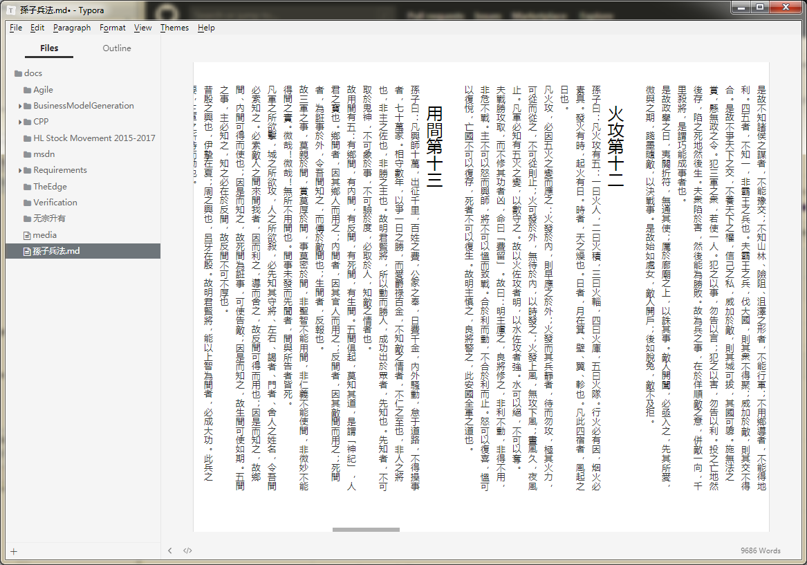

# han.css
Vertical layout of Typora Han.css.

## How to
1. Install [Typora](https://typora.io/).
2. Copy han.css to ``\user\AppData\Roaming\Typora\themes\``.
3. Launch Typora.

## References
1. https://typo.sofi.sh/
2. https://github.com/typora/typora-issues/issues/1121
